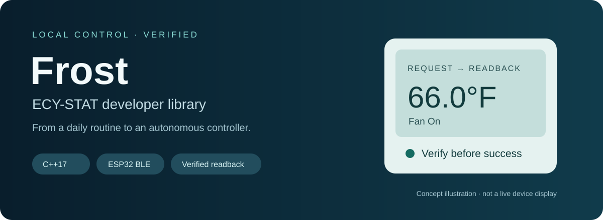
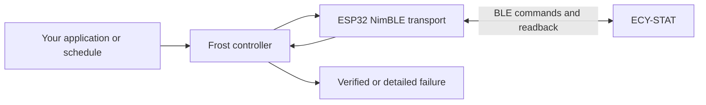

<p align="center"></p>

# Frost ECY-STAT

**Local Bluetooth control for ECY-STAT thermostats, with application-level verification.**

A C++17 library, an ESP32/NimBLE transport, and examples for first-time pairing
and a configurable daily schedule. Built from a working residential automation
project: understand the thermostat's BLE commands, apply the requested state,
and read it back before reporting success.

**Status: developer preview.** The original ATOM Lite installation has run real
scheduled temperature/fan transitions. This extracted library's new device
selection and commissioning flow has been build-checked, but not yet exercised
on hardware. See [validation and limitations](docs/validation.md).

## What it does

- Encodes ECY-STAT target-temperature and `FanOn` / `FanAuto` commands.
- Reads before applying; matching settings do not trigger writes.
- Verifies temperature, waits for fan readback, then verifies temperature again.
- Reports partial failures: changing Target and Fan is **not atomic**.
- Provides a daily schedule example with user-defined times and states.
- Uses an explicitly selected, paired thermostat; it never falls back to a nearby device.

The library controls the setpoint and fan selection. It does not implement the
thermostat's HVAC control loop, report calibrated room temperature, or support
`FanOff`, HVAC mode changes, building systems, or credential bypass.

## Small interface, real feedback

```cpp
#include "ecy_stat_controller.hpp"

// transport implements BleTransport; the ESP32 adapter is included.
frost::EcyStatController thermostat(transport);
const frost::DesiredState evening{66.0f, frost::FanMode::On};
const auto result = thermostat.ensure_applied(evening);
if (result.status == frost::ApplyStatus::Verified) {
    // Both settings were read back successfully.
}
// Otherwise inspect result.target.status and result.fan.status.
```

The portable controller knows nothing about Wi-Fi, time, or a specific board.
The schedule example owns those concerns. Calls block during BLE I/O and must
run on an application task, not a NimBLE callback.



## Start here

1. [Build and pair a new controller](docs/setup.md).
2. Configure [the scheduler example](examples/scheduler/config.example.hpp).
3. Read [behavior, compatibility and evidence](docs/validation.md).
4. Explore [the engineering case study](docs/case-study.md).

Use only a thermostat you are authorized to control. The setup example requires
your thermostat's legitimate pairing PIN. Network credentials stay in an
external configuration file; configured firmware binaries must remain private.

## Daily schedule

Edit a private configuration file before building:

```cpp
inline constexpr frost::ScheduleEntry kSchedule[] = {
    {8,  0, {68.0f, frost::FanMode::Auto}},
    {23, 0, {66.0f, frost::FanMode::On}},
};
```

Use any nonempty list of sorted, unique daily times. The controller initially
waits for synchronized time, then applies the state appropriate **now**. It
does not replay missed events. After a successful application, a manual change
on the thermostat remains until the next scheduled event or controller restart.
The example runs checks approximately every ten seconds; BLE verification takes
additional time. It is not a hard real-time scheduler.

Times use your configured local timezone. Temperature values use Fahrenheit
wire encoding. Arbitrary thermostat limits and Celsius-configured installations
have not been characterized; a finite encoded value is not proof the thermostat
will accept it.

## Development context

Read [CONTEXT.md](CONTEXT.md) for domain terms
and [the issue tracker](docs/agents/issue-tracker.md) for work conventions.

## Tests without hardware

```sh
cmake -S . -B build
cmake --build build
ctest --test-dir build --output-on-failure
```

The suites cover protocol vectors, ordered writes/readback and partial failure,
schedule transitions/retries/restarts, civil dates, and SNTP recovery with SDK
substitutes. Hardware behavior requires separate validation.

## Repository layout

| Path | Responsibility |
| --- | --- |
| `components/frost` | Portable command codec and apply/verify controller |
| `components/frost_esp32` | ESP-IDF/NimBLE transport, selected peer storage and discovery |
| `examples/commission` | USB-terminal device selection and authenticated readback |
| `examples/scheduler` | Configurable daily schedule, Wi-Fi and trusted time |
| `tests` | Host checks with simulated transport and SDK functions |

To embed Frost in an ESP-IDF project, add this repository's `components` directory
to `EXTRA_COMPONENT_DIRS` and require `frost_esp32`. Initialize NVS and the BLE
session once, load the commissioned peer, and create one long-lived transport.
Do not issue concurrent controller operations. See the examples for initialization.

MIT licensed. Created by [linvelive](https://github.com/linvelive).
